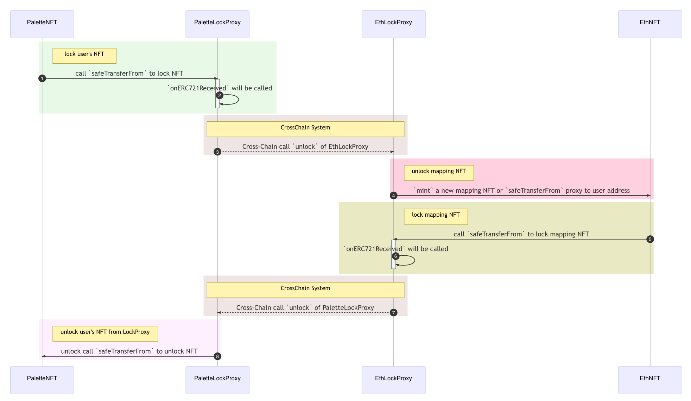

## Simple Summary

Poly Network already provided a application protocal for token cross-chain like ETH. The key part is contract `LockProxy` holding the routing information and locked assets. 

The `LockProxy` has an operator set when deploying. The operator can bind the asset with a mapping asset on other blockchain network. This mapping asset will receive the cross-chain token from original chain and the token on original chain has been locked in contract `LockProxy`. You can use that mapping token as same as original one. User is supposed to call function `lock` when crossing to other chain. And when token coming back to its birth-chain, the function `unlock` will be called to release the token locked to the user. Function `unlock` is required to be called by contract `CrossChainContract` preset in `LockProxy`. The charactor deploy `LockProxy` must be trust by users. And here is the implement [code](https://github.com/polynetwork/eth-contracts/blob/master/contracts/core/lock_proxy/LockProxy.sol).

Above is the basic logic of `LockProxy`. Here call it `ERC20LockProxy`. 

But this implementation doesn't support NFT asset because that a NFT is unique. And we need to modify and improve the protocal to satisfy the features of NFT. 

Supposed that you create an NFT contract called `Garfield` on Chain A. If owner wants to cross-chain transfer a `Garfield`, it’s not enough to cross-chain a uint256 number like the `ERC20LockProxy`. It needs to carry the corresponding URI information and **create** a new garfield cat on the destination chain. When assets are cross-chain, we lock the assets in the contract `LockProxy`. But due to the uniqueness of NFT, the mapping NFT cannot be created before cross-chain on destination chain. So when the assets are unlocked on destination chain, we need to create a mapping NFT containing the same information as the original one. To create the required, URI must be cross-chain which should be type `bytes`.

## Specification

It contains two improvements:

- Create not release when mapping asset not exist.
- Provide new fields `tokenId` and `tokenURI`.

And `NFTLockProxy` can be divide into two parts: 

- Outbound: lock user's NFT.
- Inbound: receive user's NFT.

Behind is the description of outbound channel for NFT.

When user want to cross-chain transfer his NFT, he needs to transfer NFT to the contract address of `NFTLockProxy` by calling  `safeTransferFrom` of NFT contract. And `NFTLockProxy` implements the interface `IERC721Receiver` and function `onERC721Received` will check the locked token and call `CrossChainManager` to cross-chain transfer this token. So no need to approve tokens to `LockProxy` contract before calling `lock` like `ERC20LockProxy`. It needs two transactions sent to Ethereum and `NFTLockProxy` only need one to finish the lock action with less transaction fee. 

Next is the Inbound procedure to receive NFT from other chain.

The cross-chain manager on destination chain will call the function `unlock` of `NFTLockProxy` to mint or release the NFT to user. When the `NFTLockProxy` don't own the `tokenId` cross-chained, it will call the interface `mintWithURI` of the target NFT contract. It only happens when the NFT contract is a mapping asset contract. So we require the contract implement a interface `mintWithURI` like below:

```js
pragma solidity ^0.6.0;

import "@openzeppelin/contracts/token/ERC721/ERC721.sol";
import "@openzeppelin/contracts/utils/Address.sol";

contract CrossChainNFTMapping is ERC721 {
    using Address for address; 

    address private lpAddr;

    constructor (address _lpAddr, string memory name, string memory symbol) public ERC721(name, symbol) {
        require(_lpAddr.isContract(), "lockproxy address must be contract.");
        lpAddr = _lpAddr;
    }

    modifier onlyProxy() {
        require(msg.sender == lpAddr, "");
        _;
    }

    function mintWithURI(address to, uint256 tokenId, string memory uri) public onlyProxy {
        require(!_exists(tokenId), "token id already exist");
        _safeMint(to, tokenId);
        _setTokenURI(tokenId, uri);
    }
}
```

`CrossChainNFTMapping` must deploy with parameter `_lpAddr` which is the contract address of `NFTLockProxy`. The function `mintWithURI` can only be called by the `NFTLockProxy`. Developers can just write a contract inheriting `CrossChainNFTMapping` or implement a new contract with a function `mintWithURI`. 

The base mapping NFT contract is just using for receiving the cross-chained NFT. Developers can add their application logic to start a business.

Here is the sequence diagram containing inbound and outbound.



Here is the example implementation of `onERC721Received` .

```js
function onERC721Received(address operator, address from, uint256 tokenId, bytes calldata data) public override returns (bytes4) {
    address fromAssetHash = _msgSender();
    require(data.length > 0, "length of toAddress can't be zero. ");
    require(fromAssetHash.isContract(), "caller must be a contract. ");
        
    bytes memory toAddress;
    uint64 toChainId;
    bytes memory toAssetHash;
    {
        (toAddress, toChainId) = _deserializeCallData(data);
        toAssetHash = assetHashMap[fromAssetHash][toChainId];
        require(toAssetHash.length != 0, "empty illegal toAssetHash");

        IERC721Metadata nft = IERC721Metadata(fromAssetHash);
        require(nft.ownerOf(tokenId) == address(this), "wrong owner for this token ID");

        string memory uri = nft.tokenURI(tokenId);
        TxArgs memory txArgs = TxArgs({
            toAssetHash: toAssetHash,
            toAddress: toAddress,
            tokenId: tokenId,
            tokenURI: bytes(uri)
        });
        bytes memory txData = _serializeTxArgs(txArgs);
        IEthCrossChainManager eccm = IEthCrossChainManager(IEthCrossChainManagerProxy(managerProxyContract).getEthCrossChainManager());
        
        bytes memory toProxyHash = proxyHashMap[toChainId];
        require(toProxyHash.length != 0, "empty illegal toProxyHash");
        require(eccm.crossChain(toChainId, toProxyHash, "unlock", txData), "EthCrossChainManager crossChain executed error!");
    }
    {
        emit LockEvent(fromAssetHash, from, toAssetHash, toAddress, toChainId, tokenId);
    }

    return this.onERC721Received.selector;
}
```

And here is the example implementation of `unlock` .

```js
function unlock(bytes memory argsBs, bytes memory fromContractAddr, uint64 fromChainId) public onlyManagerContract returns (bool) {
    TxArgs memory args = _deserializeTxArgs(argsBs);

    require(fromContractAddr.length != 0, "from proxy contract address cannot be empty");
    require(Utils.equalStorage(proxyHashMap[fromChainId], fromContractAddr), "From Proxy contract address error!");
    
    require(args.toAssetHash.length != 0, "toAssetHash cannot be empty");
    address toAssetHash = Utils.bytesToAddress(args.toAssetHash);

    require(args.toAddress.length != 0, "toAddress cannot be empty");
    address toAddress = Utils.bytesToAddress(args.toAddress);
    
    bool success;
    bytes memory res;
    address owner;
    bytes memory raw = abi.encodeWithSignature("ownerOf(uint256)", args.tokenId);
    (success, res) = toAssetHash.call(raw);
    if (success) {
        owner = abi.decode(res, (address));
        require(owner == address(this) || owner == address(0), "your token ID is not hold by lockproxy.");
        if (owner == address(this)) {
            raw = abi.encodeWithSignature("safeTransferFrom(address,address,uint256)", address(this), toAddress, args.tokenId);
            (success, ) = toAssetHash.call(raw);
            require(success, "failed to call safeTransferFrom");
        }
    }
    if (!success || owner == address(0)) {
        raw = abi.encodeWithSignature("mintWithURI(address,uint256,string)", toAddress, args.tokenId, string(args.tokenURI));
        (success, ) = toAssetHash.call(raw);
        require(success, "failed to call mintWithURI to mint a new mapping NFT");
    }
    
    emit UnlockEvent(toAssetHash, toAddress, args.tokenId);
    return true;
}
```

You can check the whole code [here](https://github.com/polynetwork/eth-contracts/blob/master/contracts/core/lock_proxy/NFTLockProxy.sol).

