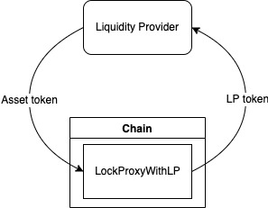
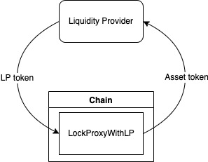
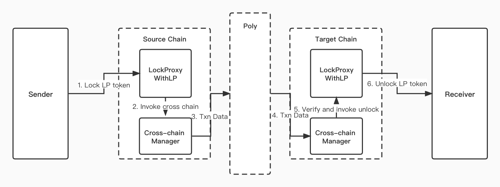
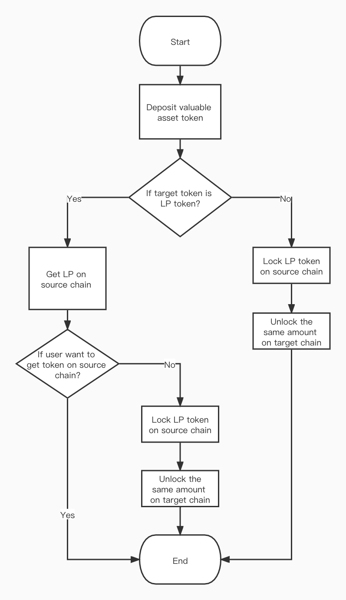

| pip  | title                                        | status | author                                           | created    |
| ---- | -------------------------------------------- | ------ | ------------------------------------------------ | ---------- |
| 4    | LockProxy contract providing liquidity proof | Draft  | Xu Jie(@[crossjay](https://github.com/crossjay)) | 2021-12-23 |

## Simple Summary

For cross-chain projects currently running on the poly network, when assets are transferred across the chain, they will choose to release additional non-value currency on the target chain to reduce the cost of the project party. However, for some projects which already have valuable asset mapping, if you want to access the Poly Network with the original lock proxy contract, you always need to lock the valuable assets in the contract, and the liquidity of this part of the asset is restricted. Here we provide a proposal that can release the liquidity of this part of the value asset to solve the need that one asset can be exchanged through multiple cross-chain bridges.

According to situation mentioned above, the Liquidity-Proof Token(following will be referred as LP token) is issued on both the target chain and the original chain, which can be exchanged with value assets on a one-to-one basis. Liquidity providers can deposit the valuable asset tokens, then get the same amount of liquidity proof tokens instead; on the other side, they can also deposit the LP tokens and get the same amount of asset tokens back.

## Motivation

There are several reasons motivating this proposal:

1. By issuing the LP token, new lock proxy contract will reduce the initial costs of assets, which already have valuable asset mapping, to connect to Poly Network. 
2. Poly Network could satisfy different kinds of situations, especially in the case that one asset needs to be exchanged through multiple cross-chain bridges.

## Specification

Among this lock proxy contract, it contains three main improvements: 

1. Liquidity deposit: for users to transfer in valuable assets and get LP token.
2. Liquidity withdrawal: for users to transfer in LP token and get valuable assets.
3. Assets sawp: To be clarified, LP contract works as an ERC20 contract which is similar with the original asset. Users could exchange their assets to either LP token or mapped valuable assets on target chain.

And `LockProxyWithLP` can be divide into two parts:

1. Exchange the LP token and valuable asset token
2. Cross-chain transfer LP token and asset token: lock LP token from users and unlock LP token to users

Detailed implementation is provided as following:

##### Liquidity deposit:

<div align=center></div>

- As the above image showing, liquidity injection will be taken by invoking the method `deposit()`, which depositing value assets and withdrawing Liquidity Proof Token.

- User calls `deposit()` method in LockProxy smart contract, offering the amount of LP to inject and the asset token address on this chain, which is mapped to LP token contract address.
- Requiring that transfer the certain amount of asset token to contract and let LP token contract transfer the same amount of LP token to the `msg.sender` successfully, the call of `deposit()` method completes.

##### Liquidity withdrawal:

<div align=center></div>

- As the above image showing, liquidity withdrawal will be taken by invoking the method `withdraw()`, which depositing Liquidity Proof Token and withdrawing value assets.
- User calls `withdraw()` method in LockProxy smart contract, offering the amount of LP to withdraw and the asset token address on this chain, which is mapped to LP token contract address.
- Requiring that transfer the certain amount of LP token to contract and let asset token contract transfer the same amount of asset token to the `msg.sender` successfully, the call of `withdraw()` method completes.

##### Cross-chain transfer LP token

<div align=center></div>

###### Lock sender's LP token

- Lock user's LP token will be taken by invoking the method lock(). The user makes LP token cross-chain transaction request through the dApp which works in source chain, `LockProxyWithLP` contract gets the transation information which contains the LP contract address on source chain the target chain id, the target address on target chain and amount of token to be transfered. By calling the function `lock()`, `LockProxyWithLP` contract will lock(transfer) the certain amount to asset contract;
- Then the transaction data is packed, which then in turn invokes the cross chain management contract. The management contract transfers the parameters of transaction data to the target chain and a cross chain transaction is created by management contract which is sent to the target chain based on block generation on source chain;

###### Unlock LP token to receiver

- Unlock user's LP token will be taken by invoking the method `unlock()`. Cross-Chain Manager contract determines the legitimacy of the cross chain transaction information and resolve the parameters of transaction data from the Poly chain transaction merkle proof and crossStateRoot contained in the block header.
- After verification through Poly and cross chain manager, transaction data could be executed on target chain.
- Then call the function `unlock()` to deserialize the transaction data and unlock (transfer) the certain amount of token to the target address on target chain and completes the cross chain contract invocation. 

##### Asset swap

<div align=center></div>

Based on the methods mentioned above, the new lock proxy contract offers an option for users to swap their assets to either LP token or valuable asset token on target chain. The above flow chart shows the process of how user swap asset to their target token. 

- If users want to get the asset token on target chain, they could cross-chain transfer asset token directly; 
- If users want to get the LP token, then they could choose to get their LP token either on source chain or target chain.


## Interfaces

Interfaces of `LockProxyWithLP` contract as defined in the PIP4.

Functions (external):

- ````solidity
  /* @notice                       This function is meant to be invoked by the user.             
   *                               Requiring that transfer the certain amount of asset token to contract and transfering
   *                               the same amount of LP token to the msg.sender successfully, the call of this method completes.                
   * @param originAssetAddress     The asset address in current chain
   * @param amount                 The amount of tokens to be transfered
   */
  function deposit(address originAssetAddress, uint amount) payable public returns (bool) {}
  ````

- ````solidity
  /* @notice                       This function is meant to be invoked by the user. 
   *                               Requiring that transfer the certain amount of LP token to contract and transfering the 
   *                               same amount of asset token to the msg.sender successfully, the call of this method completes.                       
   * @param targetTokenAddress     The asset address in current chain
   * @param amount                 The amount of tokens to be transfered
   */
  function withdraw(address targetTokenAddress, uint amount) public returns (bool)
  ````

- ````solidity
  /*  @notice                      This function is meant to be invoked by the user,
   *                               a certain amount tokens will be locked in the proxy contract the invoker/msg.sender immediately.
   *  @param fromAssetHash         The asset address in current chain
   *  @param toChainId             The target chain id                         
   *  @param toAddress             The address in bytes format to receive same amount of tokens in target chain 
   *  @param amount                The amount of tokens to be transfered cross chain
   */
  function lock(address fromAssetHash, uint64 toChainId, bytes memory toAddress, uint256 amount) public payable returns (bool)
  ````

- ````solidity
  /*  @notice                      This function is meant to be invoked by only the cross chain manager,
   *                               the same amount of tokens will be unloked from target chain proxy contract at 
   *                               the target chain with chainId later.
   *  @param argsBs                The argument bytes recevied by the ethereum lock proxy contract, need to be deserialized
   *                               based on the way of serialization in the source chain proxy contract.
   *  @param fromContractAddr      The source chain contract address
   *  @param fromChainId           The source chain id
   */
  function unlock(bytes memory argsBs, bytes memory fromContractAddr, uint64 fromChainId) onlyManagerContract public returns (bool)
  ````

Events:

- `UnlockEvent(address toAssetHash, address toAddress, uint256 amount)`
- `LockEvent(address fromAssetHash, address fromAddress, uint64 toChainId, bytes toAssetHash, bytes toAddress, uint256 amount)`
- `depositEvent(address toAddress, address fromAssetHash, address fromLPHash, uint256 amount)`
- `withdrawEvent(address toAddress, address fromAssetHash, address fromLPHash, uint256 amount)`
- `BindLPToAssetEvent(address originAssetAddress, address LPTokenAddress)`

You may refer to the full [code](https://github.com/KSlashh/eth-contracts/blob/testnet/contracts/core/lock_proxy/LockProxyWithLP.sol) of `LockProxyWithLP` contract . 


